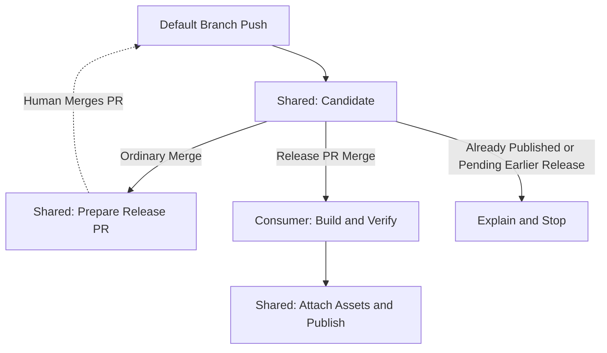

# Rust Release Candidate

Use three reusable workflows to maintain one release PR and publish its approved version after consumer builds succeed.
The [complete example](example.yaml) publishes an explicitly asset-free release.
Insert consumer build jobs and declare their required artifacts to publish binaries or archives.

## Consumer Contract

- The repository uses direct devenv or a flake-integrated devShell at its root.
- Native Rust 1.88 or newer, Cargo, Convco, Git, GitHub CLI and `sha256sum` are available inside that environment.
- Root Cargo.toml owns either `package.version` for a single package or `workspace.package.version` for a workspace.
  Workspace packages inherit `version.workspace = true` and share that one version.
- Cargo.lock is committed.
  Internal path dependency version requirements and workspace lock entries are derived during preparation.
- This initial workflow supports stable SemVer releases with `v<version>` tags.
  It does not move major aliases, publish crates, build applications or publish images.
- Required PR checks and up-to-date branch protection are configured by the consumer.
  Only merge the generated release PR after its refreshed checks pass.
  Do not add commits or use GitHub's Update Branch button on `release/next`; let prepare regenerate it.
- Give the caller one non-cancelling concurrency group with `queue: max`, as shown in the example.
  All release stages belong to that caller; the shared workflows do not reacquire its lock.

The workflow discovers the default branch through GitHub; `main`, `master` and `trunk` are supported.
Set the caller's push filter to that branch.
Release-branch pushes and PR events do not trigger the release pipeline.
The context is checked before entering consumer devenv or using write credentials.

## Inputs and Outputs

- `commit-sha` is required and must match the triggering push's full SHA.
- `job-name` sets the candidate job display name and defaults to `Identify Rust Release Candidate`.
- `runs-on`: optional JSON runner label, label array or group/labels object; empty follows the [organisation runner policy](../../docs/consumer-setup.md#runner-selection).
- `type` defaults to `devenv`; use `flakes` with `flake-shell`, which defaults to `.#default`.
- `devenv-installable` optionally pins the native devenv CLI.

The job requires Contents, Pull Requests and Actions read permissions.
No App credentials are needed for candidate inspection.

- `prepare-ready` is `true` for an ordinary current default-branch commit eligible to refresh the release PR.
- `release-ready` is `true` only for a validated merge of the managed release PR.
- `version`, `tag`, `commit-sha` and `pr-number` identify the approved release candidate.
- Both ready outputs are `false` for obsolete work, an already-published release, or an ordinary merge waiting for an earlier release to finish.
- `reason` explains those no-op decisions.

The candidate verifies the managed PR's repository, branch, marker, reviewed tree, base commit, derived version files and changelog heading.
Additional trunk commits after a correct release merge do not change the source commit to publish.
A release PR merged from a stale base fails rather than publishing an unreviewed version calculation.

Use `needs.candidate.outputs.release-ready == 'true'` to enable consumer build jobs.
Make publication depend on every required build, and keep the normal success condition.
Do not put `prepare` in publication's `needs`, because prepare is skipped during release publication.

Pin all three calls to the same reviewed release SHA containing these workflows.
The shared workflows compose their bundled actions at that same revision.
Dependabot can then update the workflow pins together.

See [preparation](../consumer-rust-release-prepare/README.md) and [publication](../consumer-rust-release-publish/README.md).

## Common Consumer Setup

See [shared setup and runner selection](../../docs/consumer-setup.md) for LFS checkout, SecretSpec profiles and optional read-only dependency App authentication.

Runner defaults follow the [organisation runner policy](../../docs/consumer-setup.md#runner-selection).
`runner-architecture` accepts `AMD64` (default) or `ARM64`; ARM64 selects `aarch64-linux` unless `system` explicitly overrides it.
Explicit `runs-on` selectors take precedence over organisation defaults.
